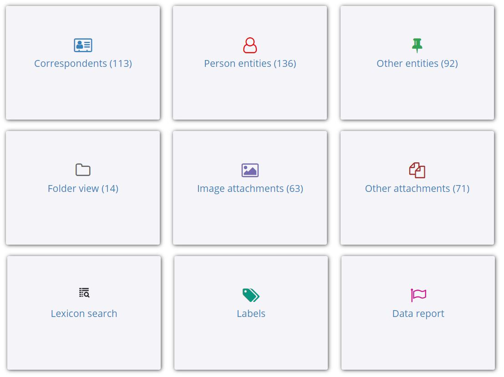
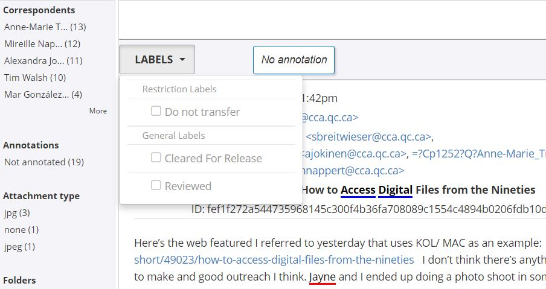

# Processing unusual file types

Certain file types require atypical processing workflows, often using specialized software. This guide documents CCA's workflows for processing unusual file types and their related software, which include:  

* [Email archives and ePADD](#email)
    * [Email formats](#emailformats)
    * [Import and appraisal module](#emailappraisal)
    * [Processing module](#emailprocessing)
    * [Export, SIPs, AIPs, and DIPs](#emailexport)
    * [Delivery module](#emaildelivery)
    * [Cleaning up ePADD](#cleanupepadd)
    
<a name="email"></a>  
## Email archives and ePADD

Email formats require additional processing, as they often contain sensitive or personal information, and as a format, are difficult to access by an end-user. [ePADD](https://library.stanford.edu/projects/epadd), developed by Stanford University Libraries, allows the processing archivist to search through email, restrict possibly sensitive materials, and provide a user-friendly access interface.

Full documentation on ePADD can be found in their [User Guide](https://docs.google.com/document/d/1ZMuWU0z-IVsk80_lUEYMfVrwfCsS1bp0sjL28GBGcMU/edit) and the [Community Forum](https://epadd.nimeyo.com/). 

ePADD can be downloaded [here](https://library.stanford.edu/projects/epadd/download), and installation instructions can be found in the User Guide. CCA recommends installing ePADD into Mac or Windows environments.

<a name="emailformats"></a>  
### Email formats 

ePADD only works with live email accounts (including IMAP) and email archives in the MBOX format. If your email archives are in a different email format, like Microsoft Outlook PST, they will need to be converted using [Emailchemy](https://weirdkid.com/emailchemy/), an email format converter located on the CD imaging workstation. Note that the readpst command line utility is not recommended, as it throws errors in ePADD. 

To use Emailchemy: 
1. Confirm the following settings are selected in Emailchemy, under Tools > Options >: 
    * General, check: 
       * De-duplicate messages while converting
       * Automatically clear de-duplicator memory after conversions
    * Files/Folders, check: 
       * Preserve folder structure
       * Allow non-English characters in new file and folder names
       * Replace disallowed filename characters with a dash
    * Logging, check: 
       * Write Conversion Log
       * Use default log file location
       * Log source file checksums before and after conversion
    * Headers, check: 
       * Strict RFC-2822 compliance for parsing
       * Preserve optional Extension and User-Defined header fields
       * Standardize dates
    * Outlook (Win), check: 
       * Save encrypted message text as attachment
       * Translate Exchange-style email address to Internet-style (SMTP)
       * Extract all message object types
2. Using the email conversion wizard, choose your source file type and click next. 
3. On the next screen, find the file or folder containing your email archives files. **If you are pointing to a folder, the files need to be in a single directory**, as Emailchemy does not recurse. Click next.
4. Ensure the "filter duplicate messages" box is checked, and all others are unchecked. Click convert. This may take some time. 
5. Find the log file created during conversion and save it to a safe place. It will eventually be included in your SIP-level metadata.

<a name="emailappraisal"></a>  
### Import and appraisal module
**NOTE:** Before importing new archives into ePADD, ensure that the previous user properly [cleaned up ePADD](#cleanupepadd) from their session.

The appraisal module is the default starting screen after launching ePADD. Appraisal is intended to be used by the donor to do initial review and restriction of their own email. Notably, the “Do not transfer” flag will effectively delete emails, preventing them from being moved to the processing module.

For CCA's purposes, the appraisal module will typically only be used for its importer, as donors do not usually review their own materials. Additional review and restriction will occur in the processing module. To import your MBOX files into ePADD: 
1. Launch ePADD by clicking epadd.exe. By default, ePADD runs with 4GB of RAM, but additional RAM may be needed for larger collections. If this is the case, download epadd-standalone.jar, and launch ePADD using the code below, where # identifies the amount of RAM (in GB) you wish to allocate. 8 GB is typically sufficient.
   ```
   java -Xmx#g -jar /file/path/to/epadd-standalone.jar
   ```
2. Click "Import" at the top of the ePADD browser. 
3. Enter as much metadata as possible. This can be added to and edited in the processing module. 
4. Point ePADD to the emails to process:
   * For public email accounts (e.g. Google, Yahoo), enter the email address and password for the account. (Note that at the time of writing, we have not been able to successfully use this feature.) 
   * For private IMAP accounts (e.g. university emails), enter the IMAP server, email address, and password for the account. You may need to be in touch with the donor or their IT provider to access their server.
   * For MBOX files, select the directory where the MBOX files are located. The files need to be in a single directory. You may also enter the name of the email source, which is an optional field.
      * **NOTE:** If you are importing a number of MBOX files, it may be worthwhile to ensure they have descriptive file names (if possible), as Emailchemy often changes the file titles and they may be difficult to distinguish during processing.
5. Click continue. The next screen will load all of the MBOX files or IMAP folders in the designated location. This may take some time. Check the box next to the appropriate folder and click Continue. (It is not necessary to input the date range at this time.)
6. ePADD will work to read the selected files. This may take some time, depending on how many emails total there are. When this process is complete, ePADD displays the emails in the appraisal module.

Because the appraisal module does not provide unique functionality, and because CCA's use case does not anticipate donor review, the next step is to export the email from the appraisal module to the processing module. In order to do so: 

1. Click the Export tab at the top of the screen.
2. Under "Export messages and attachments," click Browse, and choose C:/Users/user. Click Export (NOT "Export to MBOX"). This may take some time. It will save as "ePADD archive of (name of archive creator)." This folder is now ready to be imported into the processing module.

<a name="emailprocessing"></a>  
### Processing module

The archivist can begin reviewing, restricting, and assigning metadata in the processing module. To do so: 

1. Switch ePADD to the processing module by clicking the blue question mark in the top right corner. Click "ePADD Mode." Choose "PROCESSING" from the drop-down menu.
2. Add your archives by clicking the Add tab. Next to "Accession folder," click Browse and choose the "Archive of (archive creator) folder" created in the previous module. Fill out as much metadata as possible. You can return to this later. Click "Import Accession." This may take some time.

#### The Browse tab

Once ePADD has finished importing the accession, the archivist can begin processing the materials from the Browse screen which looks like: 



The majority of processing involves reviewing the email to ensure that it is within scope and does not contain sensitive material. While reviewing email, the Labels tab can be used to restrict materials. The labels "stick" when the archives is exported to the next module. The "Cleared for Release" and "Reviewed" flags disappear, and the emails marked "Do Not Transfer" are not moved to the next module, effectively restricting/deleting them from the collection. Emails can also be scheduled for temporary restriction; see the [User Guide](https://docs.google.com/document/d/1ZMuWU0z-IVsk80_lUEYMfVrwfCsS1bp0sjL28GBGcMU/edit) for more information.



**THROUGHOUT THIS PROCESSES YOU MUST SAVE YOUR WORK, USING THE SAVE TAB AT THE TOP OF THE SCREEN.** Your changes will not stick unless you save the archive. The review process need not occur in any particular order. ePADD provides the following tools:

1. *Correspondents:* A list of all email addresses (to, from, mentioned) in the archive, and ePADD's best guess at the contact's name and other email addresses. 
   * Edit correspondents list to correctly pair contacts with their email addresses and remove false positives.
   * Delete correspondents whose emails are out of scope.
2. *Person entities:* A list of all people recognized by ePADD. Mixed results; requires no further processing.
3. *Other entities:* A list of all places and corporate names recognized by ePADD. Mixed results; requires no further processing.
4. *Folder view:* All emails sorted by folder (e.g. Inbox, Sent, Drafts). 
   * Determine whether all folders are within scope of the collection.
   * Review "Deleted Items" folders to determine whether they should be kept. 
5. *Image attachments:* A gallery of all images attached to emails. Requires no further processing.
6. *Other attachments:* All other file types attached to emails, available for download. Requires no further processing.
7. *Lexicon search:* **INSERT LINKS** Keyword searching based on defined lexicons to identify sensitive materials. Two lexicons, [CCA.lex](../media/cca_lexicon) and German.lex, were developed for AP195, in order to collocate sensitive words relevant to CCA's use case and provide (limited) German-language functionality. Note that these lexicons should be considered in beta, and all lexicons should be considered in light of a collection's context.
   * Use lexicon searching to identify potentially sensitive and out of scope material. Lexicons can be added manually or installed; see the [Lexicon ReadMe file](https://docs.google.com/document/d/1RWU1kXUPa1kEf5_mEaNP_veQ8IX-Sw1J0mBJ8rRhS3Q/edit) and the [User Guide](https://docs.google.com/document/d/1ZMuWU0z-IVsk80_lUEYMfVrwfCsS1bp0sjL28GBGcMU/edit) for more information.
8. *Labels:* Summary of labels used. You can add new labels here if needed.
9. *Data:* Import log. It may be worth ensuring there were no major import error, but no further processing necessary.

#### The Search Tab

In addition to using the lexicons, the Search tab allows you to keyword search individually. You may want to do this if you notice out of scope email that is not flagged by lexicon searching. For example, in AP195, the archive creator used her personal email to find a new apartment. None of the relevant words were flagged by the lexicons, and keyword searching terms like "rent," "lease," and "flat" made it possible to screen out this material.

#### The Authorities Tab

<a name="emailexport"></a>  
### Export, SIPs, AIPs, and DIPs

include your emailchemy log, if you have one

<a name="emaildelivery"></a>  
### Delivery module 

The delivery module is the access interface intended for researchers. It can be opened in the "ePADD mode" tab, like with the other modules. To launch the delivery module: 

1. Move the "epadd-delivery" folder to C:/Users/user
2. Launch ePADD
3. Click the gear in the top-right corner and select "ePADD Mode." From the drop-down menu, choose "DELIVERY."

The researcher can now navigate within the email archives. They can flag and annotate material, much like in the appraisal and delivery modules, and save a marked-up version of the email archive for their personal use. 

**NOTE:** Once you are in the ePADD delivery module, you cannot easily return to the previous modules. This is to prevent researcher interference with collections in process. (This is also true for the discovery module.) To return to previous modules: 

1. Make a note of which local host ePADD is using, by consulting your browser's URL. (It is typically 9099.)
2. Close out of all ePADD tabs in your browser.
3. Launch the Terminal and run the following command, where localhost is replaced by the local host number noted in Step 1: 
   ```
   netstat –ano |findstr :localhost
   ```
4. This will return a number of values. Look for where it says LISTENING, and make a note of the number next to it. This number is called a process identifier or PID.
5. Run the following command in Terminal, replacing PID with the number noted in Step 4: 
   ```
   tskill PID
   ```
6. Relaunch ePADD.

This can also be achieved by logging out of the workstation and logging in again.

<a name="cleanupepadd"></a>
### Cleaning up ePADD
For each module, ePADD save its contents to a corresponding directory in C:/Users/user. All of emails in those directories will display in the corresponding module, regardless of provenance, meaning that they must be deleted between processing projects so that materials are not accidentally mixed. In order to clean up ePADD:
1. Go to C:/Users/user.
2. There will be a number of directories whose titles begin with "epadd-." Delete all of these directories EXCEPT "epadd-settings." 

ePADD can now be used to process a new group of emails.
